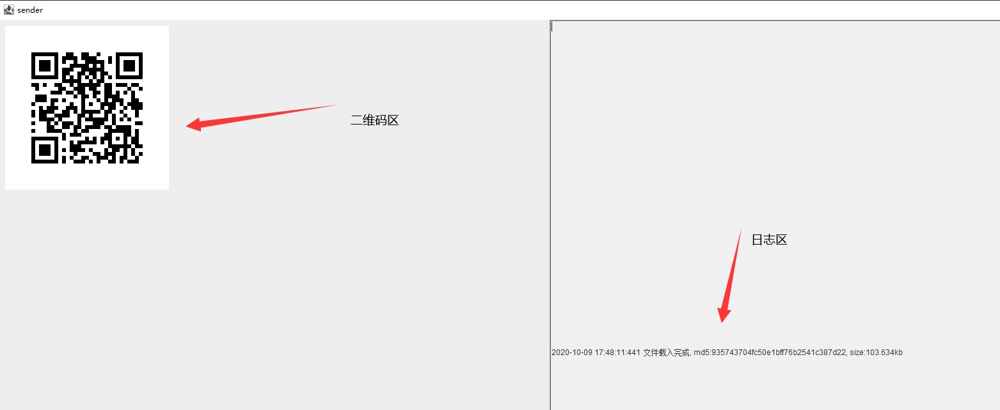
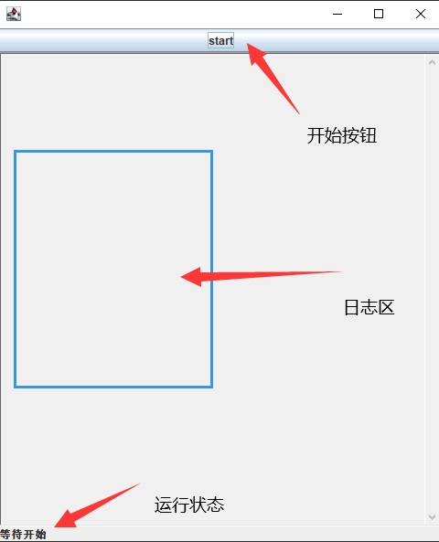
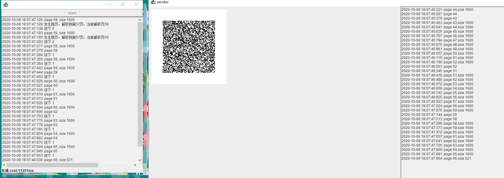

# 启动发送端
## 环境配置与启动
0、在远程桌面端安装openjdk11、拷贝sender文件夹到远程桌面端

1、修改发送端配置文件config.properties
```properties
#需要发送的文件
tar=D:/_tmp/222/tar.zip
#二维码初次尝试容纳字节数,默认1500
initQrPageSize=1600
#二维码宽度(像素)，默认256，过大过小都会影响解析，出现传输问题时考虑设置此值
qrCodeWidth=256
#是否开启二维码测试，默认true，为true时，发送端生成验证码后会测试一下是否能识别，不能则尝试自动调整initQrPageSize的值
testQr=true
```

2、启动
```
java -Dfile.encoding=utf-8 -jar sender-1.0-SNAPSHOT.jar
```
## 运行发送端
1、启动后，请认真阅读免责声明，若您传输的文件违反任何规范，请立即退出

2、点击同意后，看到如下界面，发送端即启动完成


# 启动接收端
0、在本机安装openjdk11、拷贝receiver文件夹到远程桌面端

1、修改接收端配置文件config.properties
```properties
#接收到的文件存放路径
dest=D:/_tmp/222/dest.zip
#每刷新一页后延迟多少毫秒，默认0，如果图像有延迟可适当设置此参数
pageDelay=0
```
2、启动
```
java -Dfile.encoding=utf-8 -jar receiver-1.0-SNAPSHOT.jar
```

## 开始接收
1、启动后，请认真阅读免责声明，若您传输的文件违反任何规范，请立即退出

2、点击同意后，看到如下界面，接收端即启动完成


3、点击start按钮，接收端即开始工作

4、切回到远程桌面，保持二维码区不被遮挡，鼠标点击发送端的日志框，使得鼠标焦点落在日志框上

5、双手离开键盘，程序开始执行按键操作和图像识别工作，发送端的二维码不断切换，两边日志显示进度；完成后会自动停止下来，并在接收端的左下角显示“完成，耗时xxx”字样


6、检查日志是否有异常，打开接收到的文件验证是佛完整。


# 常见问题
1、二维码不会切换。

检查鼠标焦点、检查输入法是否为半角
